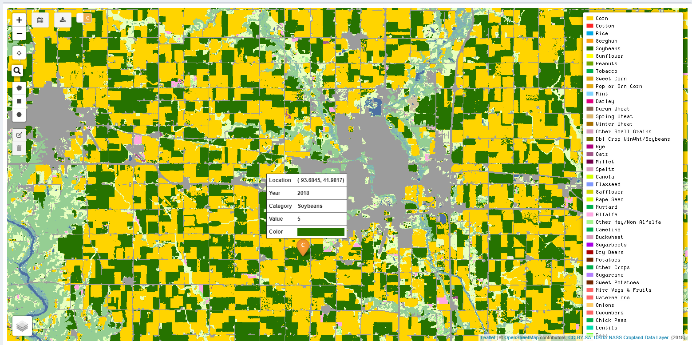
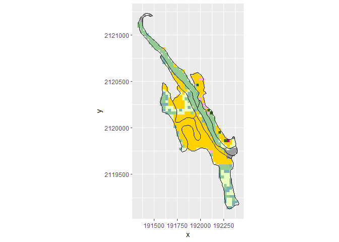

## Installation

Run the following from an R console:

``` r
if(!require("devtools")) 
  install.packages("devtools")
devtools::install_github("XiaodanLyu/viscover")
```

## Web Scraping

This tiny package is developed to web-scrape [cropland data
layer](https://nassgeodata.gmu.edu/CropScape/) (CDL) and [soil data
layer](https://websoilsurvey.sc.egov.usda.gov/App/WebSoilSurvey.aspx)
(SDL) at point-level and small domain.

### Point level

``` r
library(viscover)
GetCDLValue(year = 2018, lon = -93.65, lat = 42.03)
#> $value
#> [1] "124"
#> 
#> $category
#> [1] "Developed/High Intensity"
#> 
#> $color
#> [1] "#9C9C9C"
GetSDLValue(lon = -93.65, lat = 42.03)
#> Loading required namespace: rgeos
#> single result set, returning a data.frame
#>   areasymbol musym   mukey                               muname muacres
#> 1      IA169   L55 2800480 Nicollet loam, 1 to 3 percent slopes   45662
```

### Small domain

`poly` is an example soil spatial polygon data frame embedded in this
package.

``` r
setwd("C:/Users/lyux/")
sp::bbox(poly)
#>         min       max
#> x -93.67166 -93.65910
#> y  42.05230  42.07128
GetCDLFile(year = 2018, b = poly)
#> class       : RasterLayer 
#> dimensions  : 72, 37, 2664  (nrow, ncol, ncell)
#> resolution  : 30, 30  (x, y)
#> extent      : 191325, 192435, 2119095, 2121255  (xmin, xmax, ymin, ymax)
#> coord. ref. : +proj=aea +lat_1=29.5 +lat_2=45.5 +lat_0=23 +lon_0=-96 +x_0=0 +y_0=0 +ellps=GRS80 +towgs84=0,0,0,0,0,0,0 +units=m +no_defs 
#> data source : C:\Users\lyux\Temp\tmp.tif 
#> names       : tmp 
#> values      : 0, 255  (min, max)
```

R package `soilDB`(Skovlin and Roecker 2019) provides a convenient
function for fetching soil data by bounding box.

``` r
soilDB::mapunit_geom_by_ll_bbox(sp::bbox(poly))
#> OGR data source with driver: GML 
#> Source: "C:\Users\lyux\AppData\Local\Temp\RtmpCQXrw9\file1f046be166a9.gml", layer: "mapunitpoly"
#> with 89 features
#> It has 8 fields
#> class       : SpatialPolygonsDataFrame 
#> features    : 89 
#> extent      : -93.69867, -93.505, 41.86315, 42.20929  (xmin, xmax, ymin, ymax)
#> coord. ref. : NA 
#> variables   : 7
#> names       : areasymbol, spatialversion, musym, nationalmusym,   mukey, muareaacres, mupolygonkey 
#> min values  :      IA169,              9,   108,         2s088, 2765537,  0.66275951,    210801004 
#> max values  :      IA169,              9,     W,          ft19,  411348,  9.50876739,    210839804
```

## Overlay

`TileinPoly` gives a tabular result of the tile points overlaid with the
spatial polygon.

``` r
library(tidyverse)
cdl_tmp <- raster::raster(system.file("tif/cdl_tmp.tif", package = "viscover"))
scover <- TileinPoly(tile = cdl_tmp, poly = poly)
glimpse(scover)
#> Observations: 9
#> Variables: 2
#> $ .    <fct> 1, 5, 27, 36, 121, 141, 176, 190, 195
#> $ Freq <int> 255, 5, 1, 7, 18, 161, 69, 27, 18
```

One can refer `cdl.dbf` to interpret the CDL code. `cdl.dbf` also
contains the RGB color code used by CDL legend
(<https://www.nass.usda.gov/Research_and_Science/Cropland/docs/US_2018_CDL_legend.jpg>).

``` r
cdl.dbf %>% glimpse()
#> Observations: 255
#> Variables: 6
#> $ VALUE      <int> 0, 1, 2, 3, 4, 5, 6, 7, 8, 9, 10, 11, 12, 13, 14, 1...
#> $ CLASS_NAME <fct> Background, Corn, Cotton, Rice, Sorghum, Soybeans, ...
#> $ RED        <dbl> 0.0000000, 1.0000000, 1.0000000, 0.0000000, 1.00000...
#> $ GREEN      <dbl> 0.0000000, 0.8274510, 0.1490196, 0.6588235, 0.61960...
#> $ BLUE       <dbl> 0.00000000, 0.00000000, 0.14901961, 0.89803922, 0.0...
#> $ OPACITY    <dbl> 0, 1, 1, 1, 1, 1, 1, 1, 1, 1, 1, 1, 1, 1, 1, 1, 1, ...
scover %>% 
  mutate_if(is.factor, funs(as.integer(as.character(.)))) %>% 
  left_join(cdl.dbf %>% select(VALUE, CLASS_NAME), by = c("." = "VALUE")) %>% 
  glimpse()
#> Observations: 9
#> Variables: 3
#> $ .          <int> 1, 5, 27, 36, 121, 141, 176, 190, 195
#> $ Freq       <int> 255, 5, 1, 7, 18, 161, 69, 27, 18
#> $ CLASS_NAME <fct> Corn, Soybeans, Rye, Alfalfa, Developed/Open Space,...
```

## Visualize

### Shiny app

This package embeds a `Shiny`(Chang et al. 2018) tool to visualize the
two data layers. You can run the tool from R console using `runTool()`.
Or one can find a live tool at <https://lyux.shinyapps.io/viscover/>.



### ggplot2

One can also produce a plot of the overlaid result using
`ggplot2`(Wickham 2016). `cdlpal` returns a Hex color code when a CDL
code is provided.

``` r
library(sp)
library(raster)
cdl_pt <- cdl_tmp %>% rasterToPoints(spatial = TRUE) 
sdl_poly <- poly %>% spTransform(cdl_pt@proj4string)
cdl_pt[geometry(sdl_poly),] %>% data.frame() %>% 
  ggplot() +
  geom_tile(aes(x = x, y = y, fill = cdlpal(cdl_tmp))) + 
  scale_fill_identity() + coord_equal() +
  geom_path(aes(x = long, y = lat, group = group), data = fortify(sdl_poly))
```

<!-- -->

## References

<div id="refs" class="references">

<div id="ref-shiny">

Chang, Winston, Joe Cheng, JJ Allaire, Yihui Xie, and Jonathan
McPherson. 2018. *Shiny: Web Application Framework for R*.
<https://CRAN.R-project.org/package=shiny>.

</div>

<div id="ref-soilDB">

Skovlin, Jay, and Stephen Roecker. 2019. *SoilDB: Soil Database
Interface*. <https://CRAN.R-project.org/package=soilDB>.

</div>

<div id="ref-ggplot2">

Wickham, Hadley. 2016. *Ggplot2: Elegant Graphics for Data Analysis*.
Springer-Verlag New York. <http://ggplot2.org>.

</div>

</div>
